<h1 align="center">
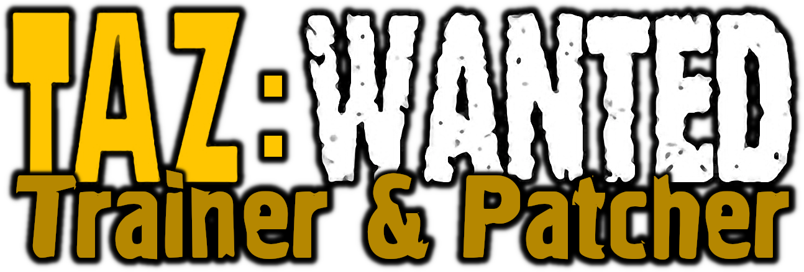 
</h1>

<a href="https://github.com/MuxaJlbl4/Taz_Wanted_trainer_and_patcher/releases/download/v4.0/Taz.Wanted.Trainer.Patcher.exe">Download v4.0</a>

Custom launcher, trainer and resource repacker for **Taz: Wanted** game

## 🥪 Achievements Tracking
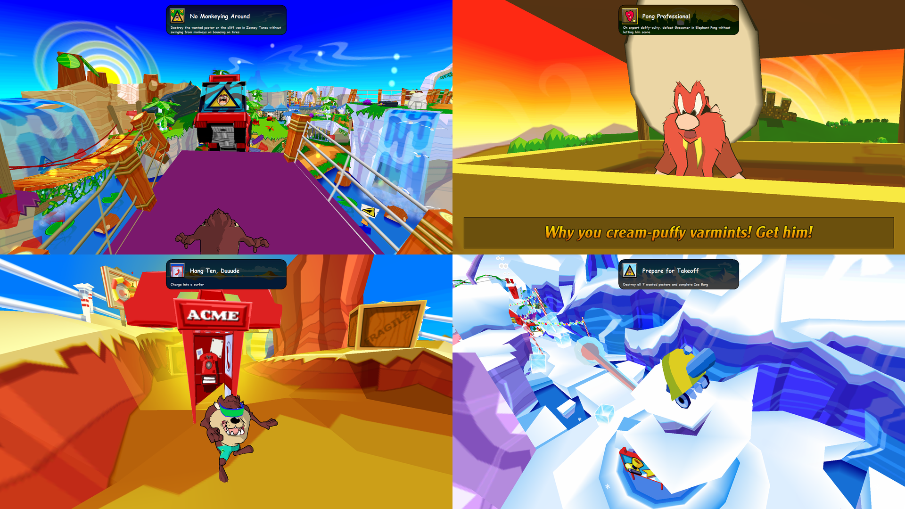

## 🧢 ACME Costumes
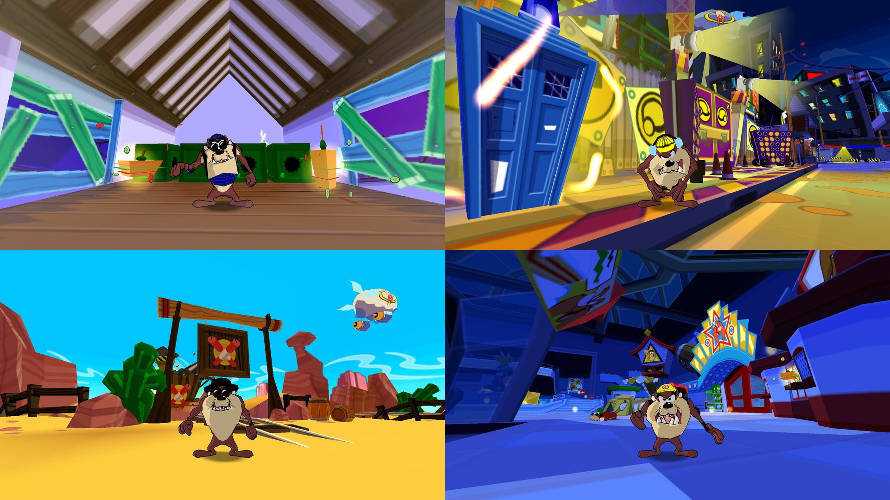

## 🔦 Airbrush Shading
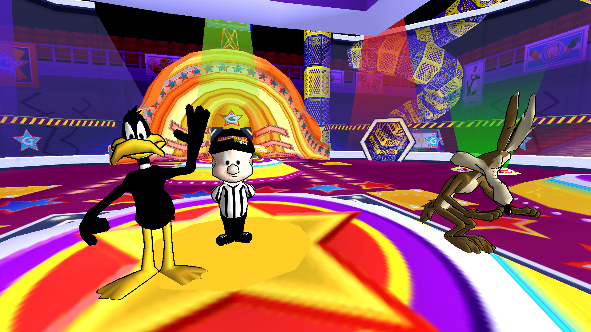

## 🖼 Application Tabs
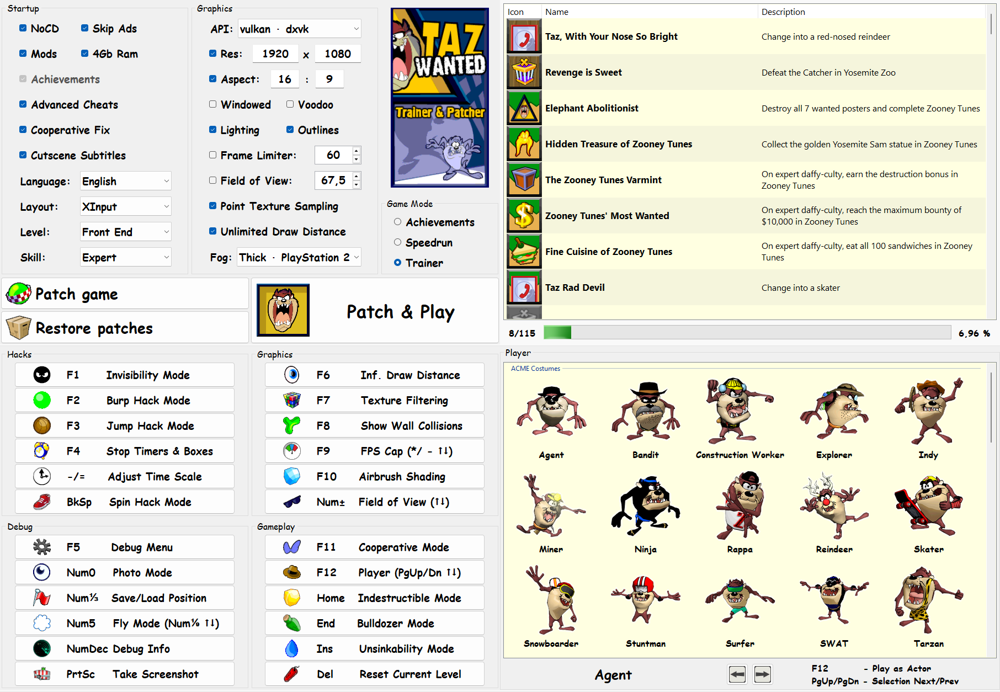

## 🎀 Cooperative Mode
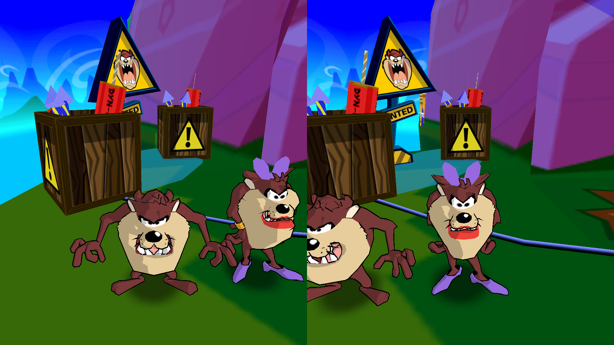

## 💬 Cutscene Subtitles
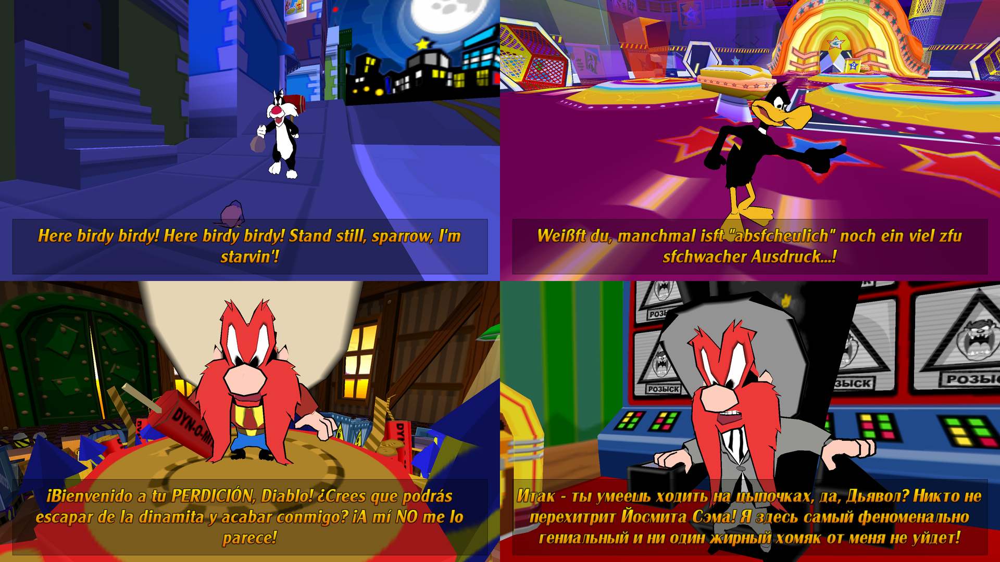

## 💻 Debug Cheats

## 👀 Draw Distance
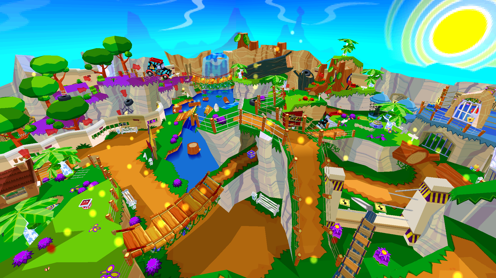

## 😎 Field of View
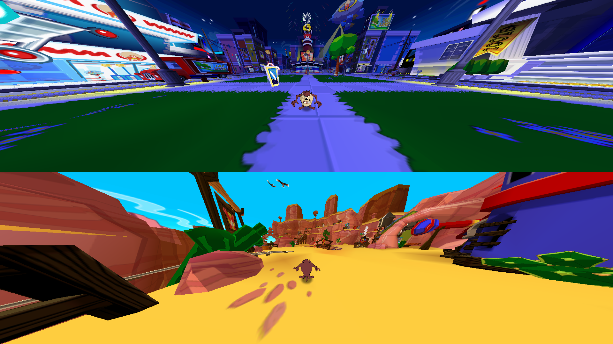

## 🌫️ Fog from PS2
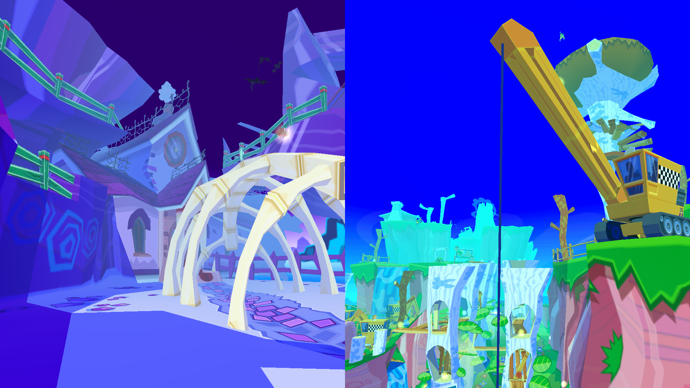

## 🫥 Gameplay Hacks
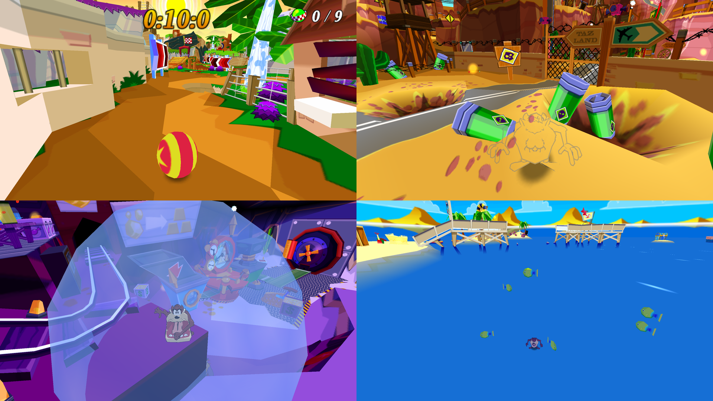

## 🍫 Graphic Wrappers
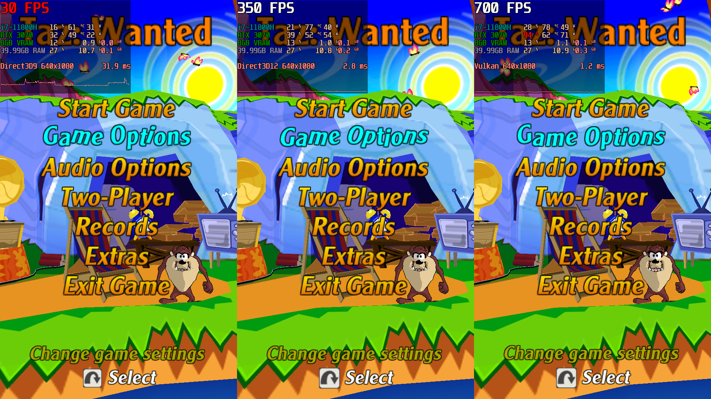

## 🎁 Mod Loader
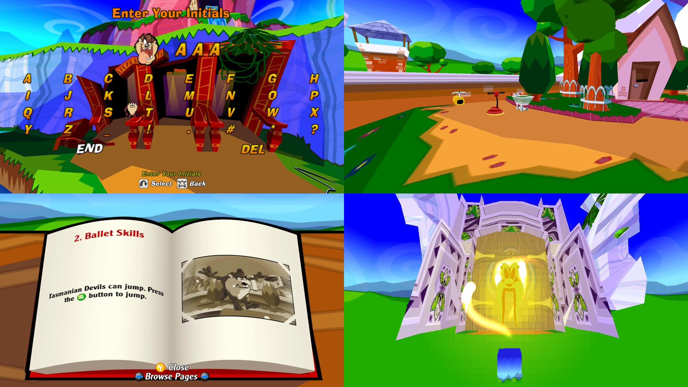

## ⭐ Playable Characters
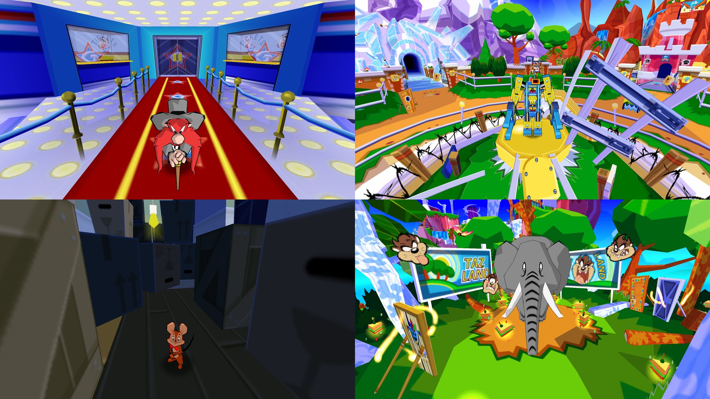

## 👾 Texture Sampling
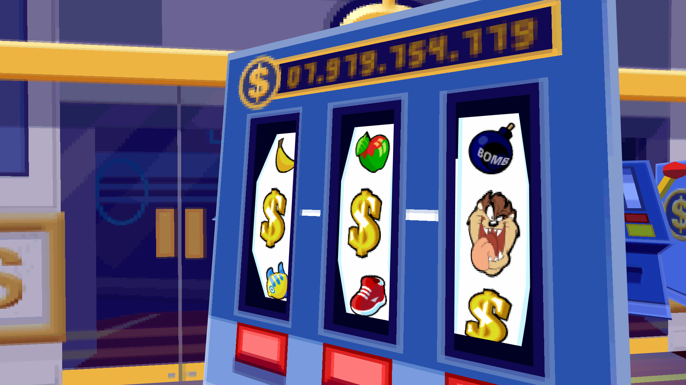

## 👻 Wall Collisions
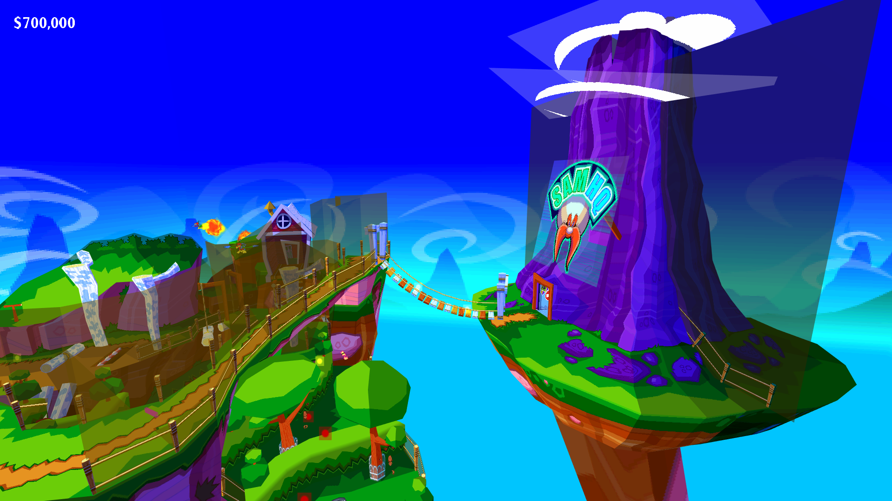

Description, usage, troubleshooting, etc. can be found on [Wiki](https://github.com/MuxaJlbl4/Taz_Wanted_trainer_and_patcher/wiki)
