<h1 align="center">
<br>
</h1>

<p align="center">
<a href="https://github.com/MuxaJlbl4/Taz_Wanted_trainer_and_patcher/releases/download/v3.0/Taz.Wanted.Trainer.Patcher.exe">Download</a>
</p>

Custom launcher, trainer and resource repacker for **Taz: Wanted** game

## 🖼 Screenshots

### 🍱 App Interface

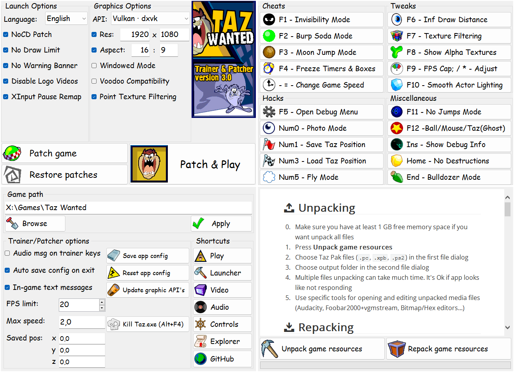

### 👀 Enhanced Draw Distance

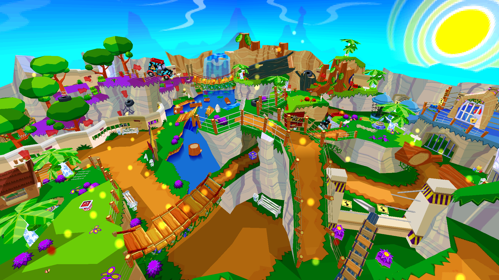

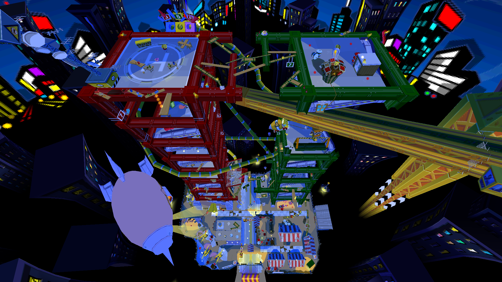

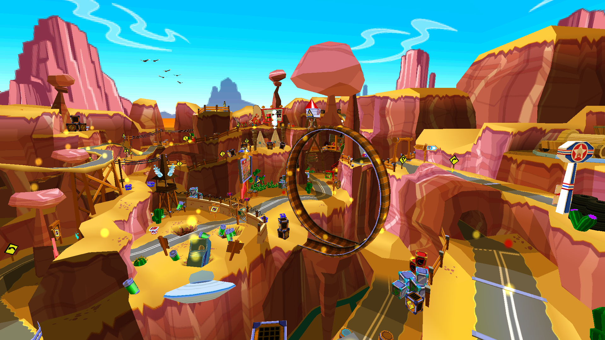

### ↔ Custom Resolution

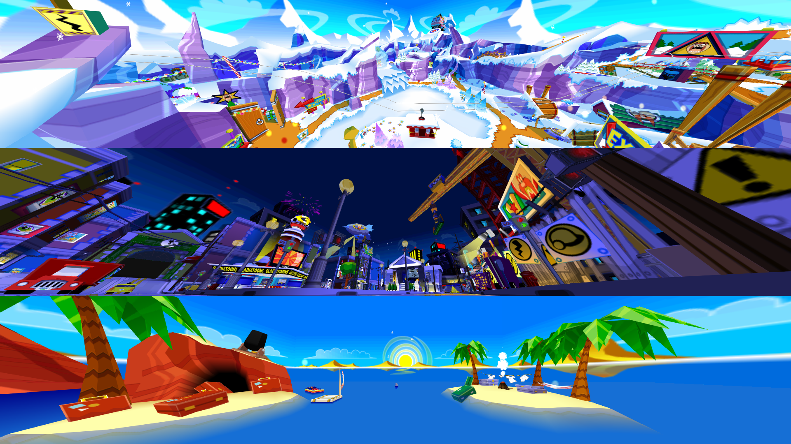

### 💡 Smooth Actor Lighting

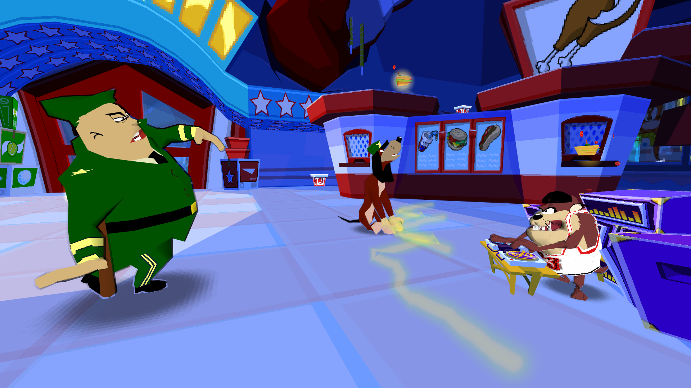

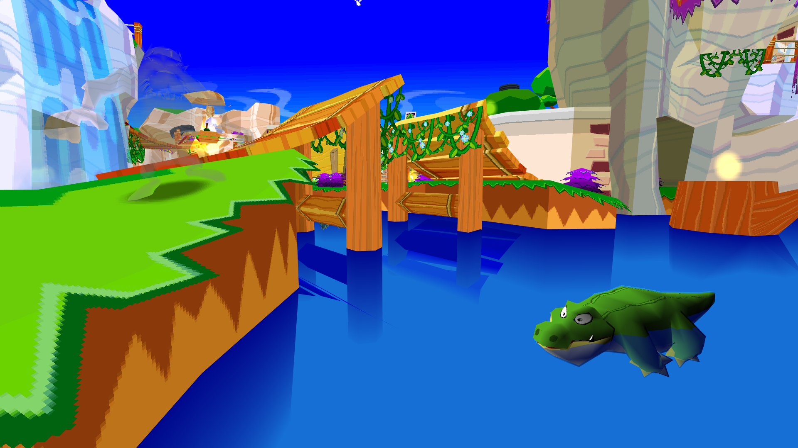

### ☢ Texture Filtering

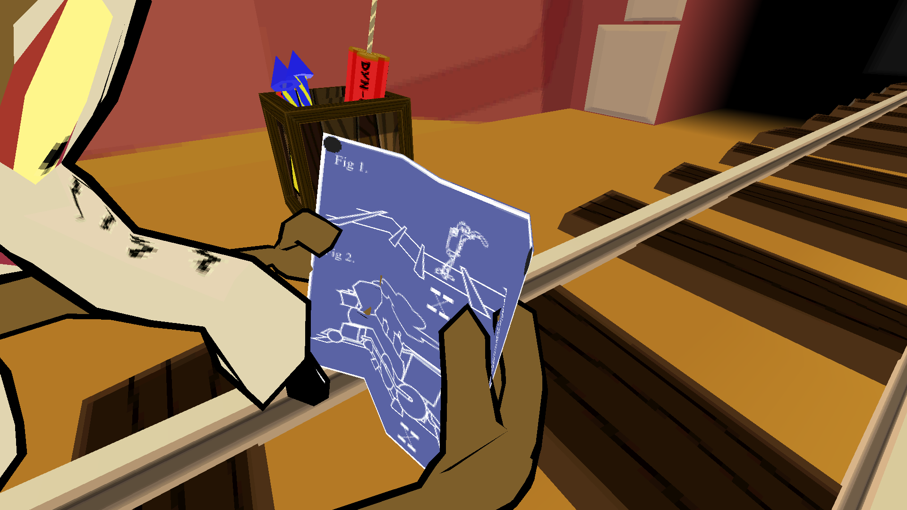

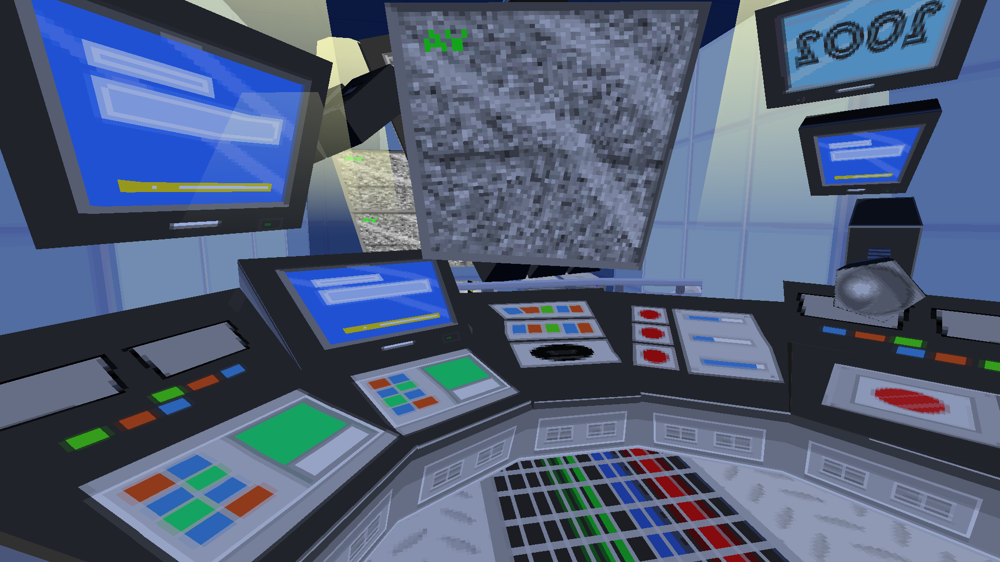

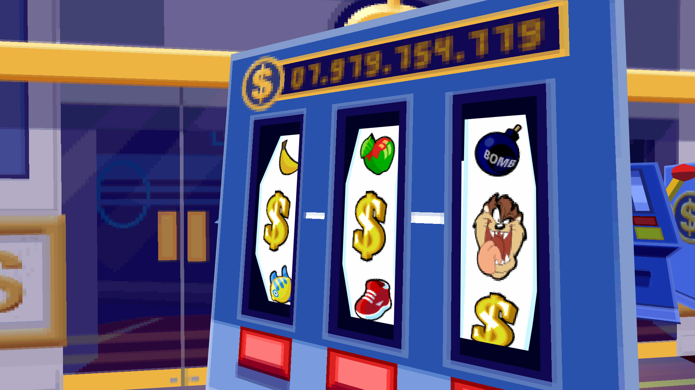

### 📦 Resource Repacking

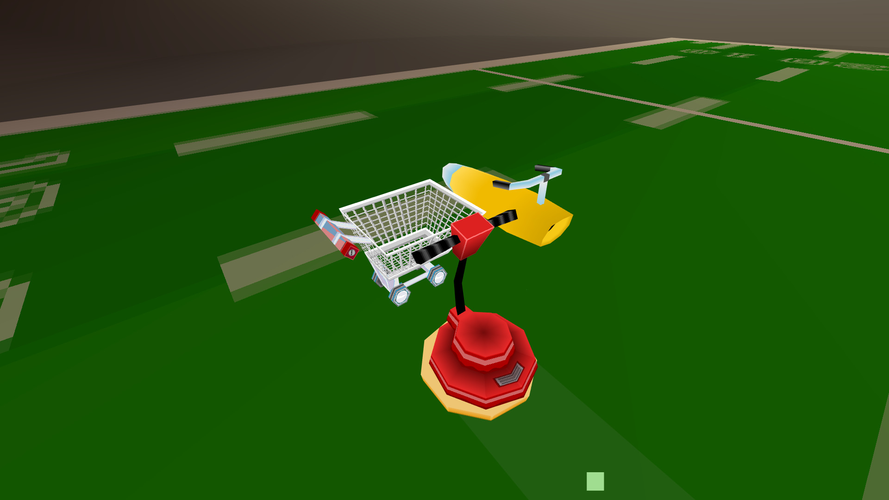

### 👻 Visible Alpha Textures


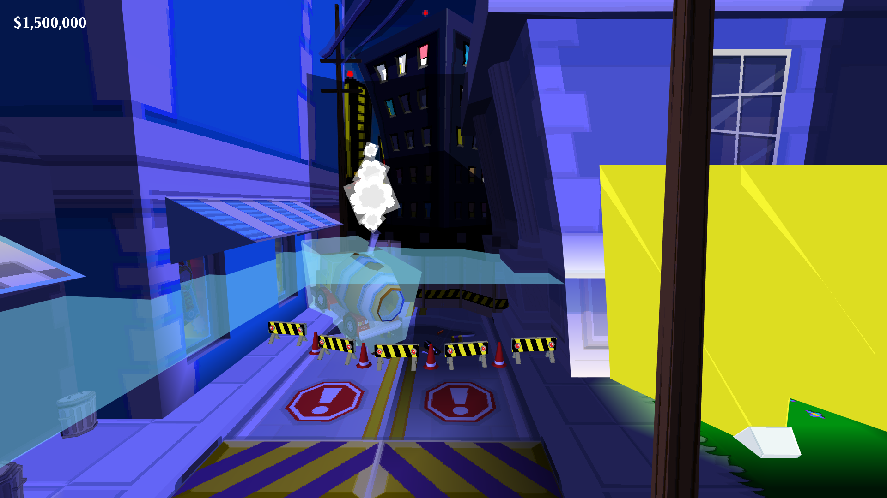

## ✏ Requirements

- **Taz: Wanted PC Game** - Europe/US installed full version
- **[Microsoft .NET Framework 4.8](https://go.microsoft.com/fwlink/?linkid=2088631) or newer** - Already preinstalled on [Windows 10 (version 1903) and newer](https://docs.microsoft.com/en-us/dotnet/framework/migration-guide/versions-and-dependencies#net-framework-48)
- **Internet Access (Optional)** - for downloading custom graphics wrappers ([d3d8to9](https://github.com/crosire/d3d8to9), [dgVoodoo2](https://github.com/dege-diosg/dgVoodoo2) and [DXVK](https://github.com/doitsujin/dxvk)) and [ReadMe](https://muxajlbl4.github.io/Taz_Wanted_trainer_and_patcher) view
- **[DirectX® End-User Runtime](https://www.microsoft.com/en-us/download/details.aspx?id=35) (Optional)** - for some custom graphics wrappers


## 🔩 Patches
- Select patches and click **Patch & Play**
- **Patch game** button just patches files without starting game
- To reset patches click **Restore patches** or just uncheck excess patches before applying

### ⌛ Launch options
- **Language:** - Change game language:
	- **English** - Text + Sound
	- **French** - Text + Sound
	- **German** - Text + Sound
	- **Italian** - Text + Sound
	- **Spanish** - Text + Sound
	- **Russian** - Text only
- **NoCD Patch** - Remove CD check during startup
- **No Draw Limit** - Limitless world draw distance
- **No Warning Banner** - Disable unskippable intro warning screen
- **Disable Logo Videos** - Disable Blitz, Infogrames and WB intro logos
- **XInput Pause Remap** - Assign Map and Pause actions to Back and Start controller buttons

### 📺 Video options
- **API:** - Download and replace graphics API to custom wrapper:
	- **D3d8 · vanilla** - Default DirectX 8.1
	- **D3d9 · [d3d8to9](https://github.com/crosire/d3d8to9)** - DirectX 9 wrapper
	- **D3d11 · [dgVoodoo2](https://github.com/dege-diosg/dgVoodoo2)** - DirectX 11 wrapper
	- **Vulkan · [dxvk](https://github.com/doitsujin/dxvk)** - Vulkan wrapper
- **Res:** - Video resolution, prefilled with system defaults
- **Aspect:** - Aspect ratio, prefilled with calculated resolution proportions
- **Windowed Mode** - Windowed mode with selected resolution and ratio
- **Voodoo Compatibility** - Simplified graphics mode, incompatible with windowed mode
- **Point Texture Filtering** - Nearest-Neighbour filtering for all textures (magnified textures only)


## 💲 Trainer
While game is running, use keys to activate/deactivate hacks:

### ☣ Cheats
- **F1 - Invisibility Mode** - Timeless test tube effect
- **F2 - Burp Soda Mode** - Timeless super burp soda can effect
- **F3 - Moon Jump Mode** - Hold jump to move up
- **F4 - Freeze Timers & Boxes** - Freeze all level timers and Whack-in-the-boxes
- **-/= - Change Game Speed** - Decrease/Increase in-game time speed; See [Settings](#-trainerpatcher-options) for custom speed

### 🐱‍💻 Hacks
- **F5 - Open Debug Menu** - Open developer debug menu with cool features; Choose `File -> Exit` to close
- **Num0 - Photo Mode** - Free look camera without text prompts; Press Bite button to teleport Taz in camera position
- **Num1/3 - Save/Load Taz Position** - Store/Restore current Taz position; See [Settings](#-trainerpatcher-options) for manual input
- **Num5 - Fly Mode** - Toggle fly mode:
	- **Num4/6** - Move in X coordinates
	- **Num2/8** - Move in Z coordinates
	- **Num7/9** - Move in Y coordinates

### 🧩 Tweaks
- **F6 - Inf Draw Distance** - Toggle draw distance limitations
- **F7 - Texture Filtering** - Toggle Nearest-Neighbour/Bilinear texture filtering
- **F8 - Show Alpha Textures** - Toggle alpha textures visibility (allows to see invisible walls)(use Show Invisible hack in debug menu as addition)
- **F9 - FPS Cap** - Toggle FPS limit (allows to use wall clipping glitches)
	- **/ \* - Adjust** - Decrease/Increase max FPS value; See [Settings](#-trainerpatcher-options) for manual input
- **F10 - Smooth Actor Lighting** - Toggle smooth lighting feature for actors (unstable)

### 📎 Miscellaneous
- **F11 - No Jumps Mode** - Toggle jump ability
- **F12 - Ball/Mouse/Taz(Ghost)** - Transform Taz to Ball or Mouse; Works only on levels with Zapper object (Taz: Haunted)
- **Ins - Show Debug Info** - Show Taz angle, position and game tick rate
- **Home - No Destructions** - Indestructible world mode
- **End - Bulldozer Mode** - One touch destructions mode


## ⚙ Settings

### 🗺 Game path
You can select game path manually by **Browse** and **Apply** buttons; It changes Windows registry value with Taz path

### 🛠 Trainer/Patcher options
- **Audio msg on trainer keys** - Play sound on trainer key press
- **Auto save config on exit** - Auto save app settings to Patcher.xml file on exit
- **In-game text messages** - Show/Hide in-game trainer messages
- **FPS limit:** - Set max FPS (Default = 20)
- **Max speed:** - Set max in-game speed (Default = 2.0)
- **Saved pos:** - Set saved Taz x/y/z coordinates (Default = 0/0/0)
- **Save app config** - Save app settings to Patcher.xml file
- **Reset app config** - Delete Patcher.xml file and restart app with default settings
- **Update graphic API's** - Download latest graphics API wrappers to game folder ([D3D9](https://github.com/crosire/d3d8to9), [D3D11](https://github.com/dege-diosg/dgVoodoo2) and [Vulkan](https://github.com/doitsujin/dxvk))
- **Kill Taz.exe (Alt+F4)** - Terminate game process (hooked as Alt+F4 in game)

### ⛳ Shortcuts
- **Play** - Start game
- **Launcher** - Open native Taz: Wanted launcher
- **Video** - Open native video setup
- **Audio** - Open native audio setup
- **Controls** - Open native controls setup
- **Explorer** - Open game folder in Windows explorer
- **GitHub** - Link to [Taz: Wanted · Trainer & Patcher](https://github.com/MuxaJlbl4/Taz_Wanted_trainer_and_patcher) project


## 🎲 Repacking

### 📤 Unpacking
0. Make sure you have at least 1 GB free memory space if you want unpack all files
1. Press **Unpack game resources**
2. Choose Taz Pak files (`.pc`, `.xpb`, `.ps2`) in the first file dialog
3. Choose output folder in the second file dialog
4. Multiple files unpacking can take much time. It's Ok if app looks like not responding
5. Use specific tools for opening and editing unpacked media files (Audacity, Foobar2000+vgmstream, Bitmap/Hex editors...)

### 📥 Repacking
0. It's recommended to make backup of original Pak files
1. Press **Repack game resources**
2. Choose folder with unpacked resources in the first file dialog
3. Choose output file in the second file dialog


## 🎨 Modding
As an example, you can add vehicles at the level:
1. Unpack any `.pc` file with `.lom` file
2. Add objects to `.lom` file:
```c
Level
{
    ...
	Object
	{
		Name = "floorpolisher"
		SPECIALTYPE = "VEHICLE"
		TYPE = "FLOORPOLISHER"

		Instance
		{
			Name = "floorpolisher00"
			PosX = 0.000
			PosY = -5050.00
			PosZ = 0.000
			RotX = 0.000
			RotY = 1.000
			RotZ = 0.000
			RotW = 0.000
			SclX = 1.000
			SclY = 1.000
			SclZ = 1.000
		}
	}
	
	Object
	{
		Name = "MOTION"
		SPECIALTYPE = "VEHICLE"
		TYPE = "ROCKETBIKE"

		Instance
		{
			Name = "MOTION00"
			PosX = 200.00
			PosY = -5050.00
			PosZ = 0.000
			RotX = 0.000
			RotY = 0.000
			RotZ = 0.000
			RotW = -1.000
			SclX = 1.000
			SclY = 1.000
			SclZ = 1.000
		}
	}
	
	Object
	{
		Name = "trolley"
		SPECIALTYPE = "VEHICLE"
		TYPE = "TROLLEY"

		Instance
		{
			Name = "trolley00"
			PosX = 0.000
			PosY = -5050.00
			PosZ = 200.00
			RotX = -0.000
			RotY = -0.500
			RotZ = 0.000
			RotW = -0.500
			SclX = 1.000
			SclY = 1.000
			SclZ = 1.000
		}
	}
    ...
}
```

3. Replace **PosX/Y/Z** with **STARTPOSITION** (or any other) values

4. Create folders and files (copy from other unpacked `.pc` files):
- `\objects\floorpolisher.obe` - vrmuseum.pc
- `\objects\motion.obe` - vrgrandc.pc
- `\objects\trolley.obe` - vrdeptstr.pc
- `\textures\cleaner.bmp` - vrmuseum.pc
- `\textures\cleaner2.bmp` - vrmuseum.pc
- `\textures\cleaner2a.bmp` - vrmuseum.pc
- `\textures\cleaner3.bmp` - vrmuseum.pc
- `\textures\cleaner3a.bmp` - vrmuseum.pc
- `\textures\cleaner4.bmp` - vrmuseum.pc
- `\textures\cleaner5.bmp` - vrmuseum.pc
- `\textures\cleanera.bmp` - vrmuseum.pc
- `\textures\trolleyhandle01.bmp` - vrdeptstr.pc
- `\textures\trolleyhandle03.bmp` - vrdeptstr.pc
- `\textures\trolleyhandle04.bmp` - vrdeptstr.pc
- `\textures\trolleymesh01.bmp` - vrdeptstr.pc
- `\textures\trolleymesh02.bmp` - vrdeptstr.pc
- `\textures\trolleymesh03.bmp` - vrdeptstr.pc
- `\textures\trolleywheel01.bmp` - vrdeptstr.pc
- `\textures\trolleywheel02.bmp` - vrdeptstr.pc
- `\textures\trolleywheel03.bmp` - vrdeptstr.pc

5. Repack results back as original .pc file


## 💡 Known Issues and Solutions
- Custom graphics API behavior may vary on different videoadapters and OSes: In case of possible problems: try launch game/patcher with integrated/discrete graphics in windowed/fullscreen mode or try debug (dbg) DLL version
- dgVoodoo watermark can be disabled by `...\Taz Wanted\Wrappers\dgVoodoo2\dgVoodooCpl.exe` (DirectX Tab -> Miscellaneous -> dgVoodoo Watermark: Uncheck -> Apply)
- Levels loaded from debug menu crashes on scoreboard - make sure you have created user on 3rd save slot
- Once used Smooth Actor Lighting tweak crashes game in some scenes - use with caution
- Russian game version crashes in Cheats Debug Menu - use another language to avoid it
- Unpacking doesn't support GameCube (.gc) files - use [QuickBMS](http://aluigi.altervista.org/quickbms.htm) with [blitz_games.bms](http://aluigi.altervista.org/bms/blitz_games.bms) script


## 📝 Notes
- 👍 Thanks for these cool repos:
	- [d3d8to9](https://github.com/crosire/d3d8to9)
	- [dgVoodoo2](https://github.com/dege-diosg/dgVoodoo2)
	- [DXVK](https://github.com/doitsujin/dxvk)
	- [ExtractTarGz](https://gist.github.com/ForeverZer0/a2cd292bd2f3b5e114956c00bb6e872b)
	- [FormSerialisor](https://github.com/Skkay/FormSerialisor)
	- [GlobalKeyboardHook](https://github.com/jparnell8839/globalKeyboardHook)
	- [markdown-only](https://github.com/aleen42/markdown-only)
- ⚠️ Be careful with storing personal files in game folder - it can be modified/deleted by patches
- 🏆 This app is not allowed in competitive [speedrun.com](https://www.speedrun.com/taz_wanted) runs
- 😎 Fell free to report any [Issues](https://github.com/MuxaJlbl4/Taz_Wanted_trainer_and_patcher/issues) and [Pull Requests](https://github.com/MuxaJlbl4/Taz_Wanted_trainer_and_patcher/pulls)
- ⭐ Also don't forget to give me a star :) Thanks!


## ❤ Special Thanks to:
[Milk](https://www.youtube.com/channel/UC8ZrxS78M9TqB_2cMlIWJMA)[Games](https://github.com/MilkGames), [Cyclone](https://www.youtube.com/c/CycloneFN)[FN](https://pastebin.com/u/CycloneFN) and to the whole [Taz: Wanted Speedrunning Discord](https://discord.gg/asYMj2EDv9) Community

